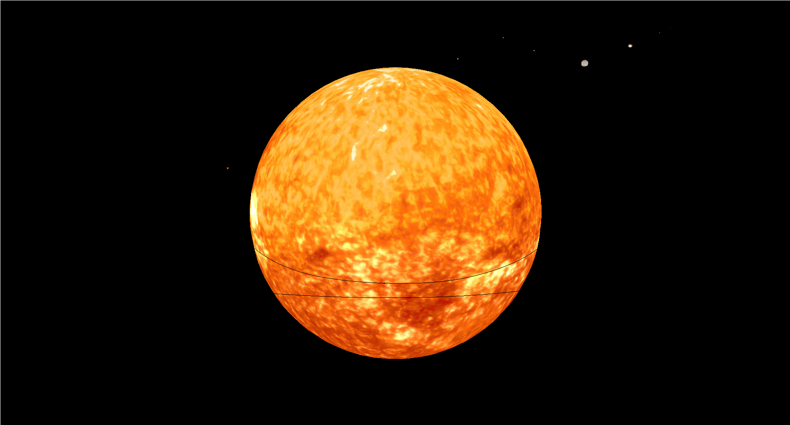

# 3D Engine
3D graphics engine built for academic purposes using C/C++ and OpenGL. 
The engine reads scene configuration files (in XML format) and renders models based on corresponding configuration files.

Project developed in the context of the Computer Graphics course at **Universidade do Minho**.

## Build Status

## Setup

### Dependencies
- [OpenGL](https://www.opengl.org/about/)
- [DevIL](http://openil.sourceforge.net/)
- [Libxml2](http://www.xmlsoft.org/)
- [freeGLUT](http://freeglut.sourceforge.net/)
- [Glew](http://glew.sourceforge.net/) (if not APPLE)

### Script

## Usage

## Built With

- [OpenGL](https://www.opengl.org/about/)
- [DevIL](http://openil.sourceforge.net/)
- [Libxml2](http://www.xmlsoft.org/)

## License

Licensed under the MIT License, see [LICENSE.md](LICENSE) for more details.
